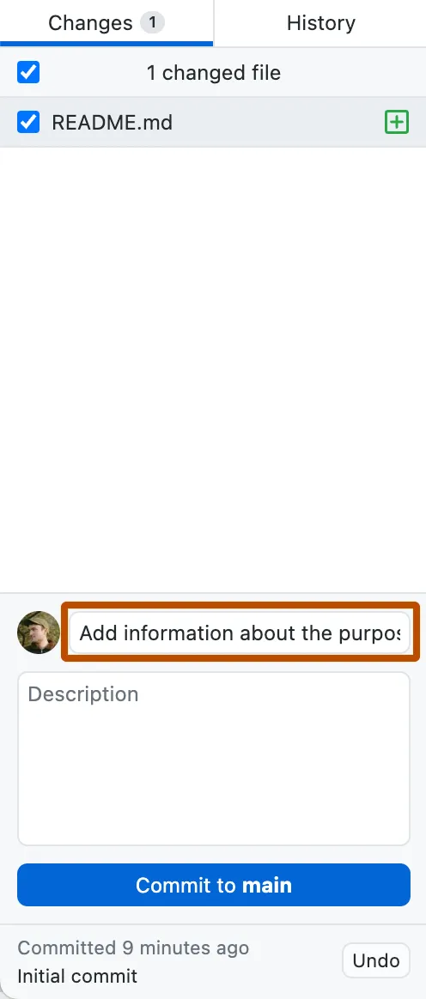
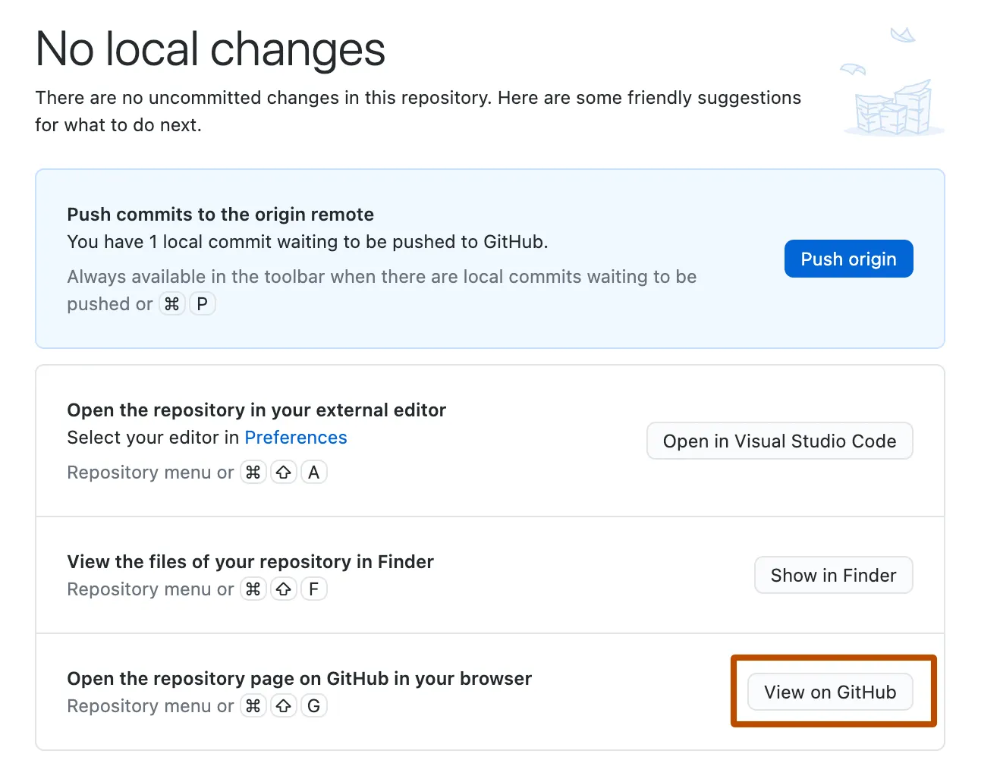

# AREC 596: Getting Started with Github Desktop
This repo is a tutorial for teaching students in AREC 596 how to use Github Desktop. It borrows instructions from the [Github Docs page on how to use Github Desktop](https://docs.github.com/en/desktop/installing-and-configuring-github-desktop/overview/creating-your-first-repository-using-github-desktop).

## Part 1: Installing GitHub Desktop and authenticating your account
You all should have done this before class. But if not, you can install GitHub Desktop on any supported operating system. After you install the app, you will need to sign in and authenticate your account on GitHub or GitHub Enterprise before you can create and clone a tutorial repository.

For more information on installing and authenticating, see "[Setting up GitHub Desktop](https://docs.github.com/en/desktop/installing-and-configuring-github-desktop/installing-and-authenticating-to-github-desktop/setting-up-github-desktop)."

## Part 2: Exploring Github Desktop
In the file menu at the top of the screen, you can access settings and actions that you can perform in GitHub Desktop. Most actions also have keyboard shortcuts to help you work more efficiently. For a full list of keyboard shortcuts, see "[GitHub Desktop keyboard shortcuts](https://docs.github.com/en/desktop/installing-and-configuring-github-desktop/overview/github-desktop-keyboard-shortcuts)."

### The GitHub Desktop repository bar
At the top of the GitHub Desktop app, you will see a bar that shows the current state of your repository.

- Current repository shows the name of the repository you're working on. You can click Current repository to switch to a different repository in GitHub Desktop.
- Current branch shows the name of the branch you're working on. You can click Current branch to view all the branches in your repository, switch to a different branch, or create a new branch. Once you create pull requests in your repository, you can also view these by clicking on Current branch.
- Publish repository appears because you haven't published your repository to GitHub yet, which you'll do later in the next step. This section of the bar will change based on the status of your current branch and repository. Different context dependent actions will be available that let you exchange data between your local and remote repositories.

### Changes and History
In the left sidebar, you'll find the Changes and History views.

- The **Changes** view shows changes you've made to files in your current branch but haven't committed to your local repository. At the bottom, there is a box with "Summary" and "Description" text boxes and a **Commit to BRANCH** button. This is where you'll commit new changes. The **Commit to BRANCH**button is dynamic and will display which branch you're committing your changes to.
- The **History** view shows the previous commits on the current branch of your repository. You should see an "Initial commit" that was created by GitHub Desktop when you created your repository. To the right of the commit, depending on the options you selected while creating your repository, you may see *.gitattributes*, *.gitignore*, LICENSE, or README files. You can click each file to see a diff for that file, which is the changes made to the file in that commit. The diff only shows the parts of the file that have changed, not the entire contents of the file

## Part 3: Publishing your repository to GitHub
When you create a new repository, it only exists on your computer and you are the only one who can access the repository. You can publish your repository to GitHub to keep it synchronized across multiple computers and allow other people to access it. To publish your repository, push your local changes to GitHub.

1. In the repository bar, click Publish repository.

2. In the "Publish Repository" window, enter details for your new repository.
     
  - GitHub Desktop automatically fills the "Name" and "Description" fields with the information you entered when you created the repository.
  - Keep this code private lets you control who can view your project. If you leave this option unselected, other users on GitHub will be able to view your code. If you select this option, your code will not be publicly available.
  - The Organization drop-down menu, if present, lets you publish your repository to a specific organization that you belong to on GitHub.

3. Click Publish Repository.
4. You can access the repository on GitHub.com from within GitHub Desktop. In the file menu, click Repository, then click View on GitHub. This will take you directly to the repository in your default browser.

## Part 4: Making, committing, and pushing changes
Now that you've created and published your repository, you're ready to make changes to your project and start crafting your first commit to your repository.

1. To launch your external editor from within GitHub Desktop, in the "GitHub Desktop" menu bar, select Repository, then click Open in EDITOR. For more information, see "Configuring a default editor in GitHub Desktop."

2. Make some changes to the README.md file that you previously created. You can add information that describes your project, like what it does and why it is useful. When you are satisfied with your changes, save them in your text editor.

3. In GitHub Desktop, navigate to the Changes view. In the file list, you should see your README.md. The checkbox to the left of the README.md file indicates that the changes you've made to the file will be part of the commit you make. In the future, you might make changes to multiple files but only want to commit the changes you've made to some of the files. If you click the checkbox next to a file, that file will not be included in the commit.

4. At the bottom of the Changes list, enter a commit message. To the right of your profile picture, type a short description of the commit. Since we're changing the README.md file, "Add information about purpose of project" would be a good commit summary. Below the summary, you'll see a "Description" text field where you can type a longer description of the changes in the commit, which is helpful when looking back at the history of a project and understanding why changes were made. Since you're making a basic update of a README.md file, you can skip the description.

5. Below your commit message, click Commit to BRANCH NAME. The commit button shows your current branch so you can be sure to commit to the branch you want.

6. To push your changes to the remote repository on GitHub, click Push origin.

  - The Push origin button is the same one that you clicked to publish your repository to GitHub. This button changes contextually based on where you are at in the Git workflow. It should now say Push origin with a 1 next to it, indicating that there is one commit that has not been pushed up to GitHub.
  - The "origin" in Push origin means that you are pushing changes to the remote called origin, which in this case is your project's repository on GitHub.com. Until you push any new commits to GitHub, there will be differences between your project's repository on your computer and your project's repository on GitHub.com. This allows you to work locally and only push your changes to GitHub.com when you're ready.

7. In the window to the right of the Changes view, you'll see suggestions for actions you can do next. To open the repository on GitHub in your browser, click View on GitHub.

8. In your browser, click 2 commits. You'll see a list of the commits in this repository on GitHub. The first commit should be the commit you just made in GitHub Desktop.

## Conclusion
You've now created a repository, published the repository to GitHub, made a commit, and pushed your changes to GitHub. You can follow this same workflow when contributing to other projects that you create or collaborate on.
